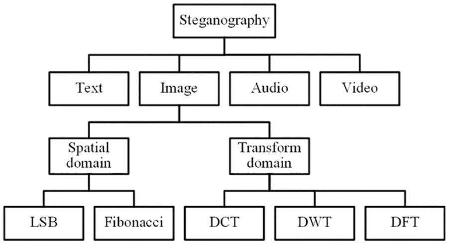

# ❓ What actually is Digital Forensics?

## <mark style="color:green;">TỔNG QUAN:</mark>

&#x20;    Digital Forensics - đây có lẽ là một cụm từ khá mới mẻ đối với bạn nào mới chân ướt chân ráo vào ngành ATTT, nhưng lại là một cụm từ khá đỗi quen thuộc với các bạn theo ngành này :D. Vậy rốt cuộc DF là gì?

<figure><figcaption>
Là gì được nhỉ :v
</figcaption></figure>

> _<mark style="color:yellow;">**Digital forensic science is a branch of forensic science that focuses on the recovery and investigation of material found in digital devices related to cybercrime (EC-Council)**</mark>_

Nếu các bạn có xem hoặc theo dõi các bộ phim hình sự truyền hình Việt Nam, các bộ phim hình sự của nước ngoài hoặc ngay ngoài đời sống hiện tại thì chắc hẳn, khi tới các hiện trường vụ án đều xuất hiện các tổ đội điều tra. Đối với môi trường không gian mạng hiện nay cũng vậy, khi đối mặt với việc xuất hiện tin tặc thường xuyên và gây thiệt hại đáng kể đối với các cá nhân, tổ chức lớn, ý thức nâng cao về an toàn thông tin cũng dần dần được gầy dựng. Từ đó Digital Forensics cũng được xuất hiện, chúng ta có thể thấy chủ yếu ở các cơ quan công an, cơ quan cảnh sát hiện nay đều có phòng ban này như FBI, Interpol, ... hoặc một quốc gia có thể có một cục riêng như ở Việt Nam với tên "Cục An ninh mạng và phòng, chống tội phạm sử dụng công nghệ cao" (A05).

<mark style="color:orange;">Digital Forensics & Incident Response</mark> có nghĩa là <mark style="color:orange;">điều tra số và ứng phó sự cố</mark> hoặc có tên mĩ miều hơn là <mark style="color:orange;">pháp chứng kĩ thuật số</mark>. Tóm gọn lại đây là một quá trình thu thập, xác định, tổng hợp, phân tích, ... các bằng chứng số (ổ đĩa, máy tính hoặc các bằng chứng liên quan đến cuộc tấn công mạng, ...)&#x20;

## <mark style="color:green;">PHÂN LOẠI:</mark>

&#x20;    Dựa vào các tính chất của công việc mà người ta chia mảng này ra thành các loại như sau:

* <mark style="color:orange;">Memory Forensics</mark>
* <mark style="color:orange;">Network Forensics</mark>
* <mark style="color:orange;">Disk Forensics</mark>
* <mark style="color:orange;">Email Forensics</mark>
* <mark style="color:orange;">Mobile Forensics</mark>
* <mark style="color:orange;">...</mark>

&#x20;    Tuy nhiên trong bài viết này mình sẽ hướng tới các Categories trong CTF nhiều hơn:



&#x20;    <mark style="color:orange;">Memory Forensics</mark> (hay còn gọi là <mark style="color:orange;">điều tra bộ nhớ</mark>) là quá trình ghi lại bộ nhớ của thiết bị và sau đó phân tích bản ghi để tìm các bằng chứng liên quan đến công cuộc điều tra. Trong suốt quá trình điều tra bộ nhớ chúng ta sẽ sử dụng bộ nhớ <mark style="color:orange;">RAM</mark> (Random Access Memory) để làm phương tiện điều tra chính.

<figure><figcaption>
 Các thanh RAM
</figcaption></figure>

### <mark style="color:green;">Tại sao lại cần sử dụng RAM?</mark>

&#x20;    RAM là bộ nhớ khả biến (tạm) của máy tính giúp lưu trữ thông tin, dữ liệu và cho phép đọc, ghi chúng ở bất kì vị trí nào theo địa chỉ để CPU có thể truy xuất và xử lý một cách nhanh chóng. Tuy nhiên RAM chỉ là bộ nhớ “tạm”, có nghĩa là nó không thể lưu trữ dữ liệu khi mất đi nguồn điện cung cấp => Tắt máy, sập nguồn thì dữ liệu RAM sẽ bị xoá đi (các bạn có thể tìm kiếm thêm thông tin về phần này với keyword: "<mark style="color:orange;">Volatile Data</mark>").

#### <mark style="color:green;">Hầu hết chúng ta đều biết dữ liệu được ghi trong RAM sẽ mất đi, nhưng tại sao lại phải sử dụng nó trong các công cuộc điều tra số?</mark>

&#x20;    Dựa vào các khái niệm ta có thể rút ra rằng: Vào thời điểm mà một chương trình đang chạy, các dữ liệu, thông tin mà nó sử dụng đều được ghi/lấy trong bộ nhớ RAM. Ngoài ra, các malware hiện nay còn có thể chạy trong RAM, bởi thế, để có thể phát hiện nó và phân tích, chúng ta cần phải sử dụng RAM. RAM có thể chứa các thông tin của các tiến trình đang chạy, về thông tin các port, ip trong network cho đến log browser, hình nền, …

<figure><figcaption></figcaption></figure>



&#x20;    <mark style="color:orange;">Disk Forensics</mark> - <mark style="color:orange;">Điều tra phương tiện lưu trữ</mark>, là việc thu thập, phân tích dữ liệu được lưu trữ trên các <mark style="color:orange;">phương tiện lưu trữ vật lý</mark> (ổ đĩa, usb, ... hay các bộ nhớ ngoài nói chung), nhằm trích xuất dữ liệu ẩn, khôi phục các tập tin bị xóa, qua đó xác định được các thông tin, bằng chứng trên thiết bị được phân tích.

&#x20;.png>)                  .png>)

### <mark style="color:green;">Dữ liệu bị mất, bị xoá rồi liệu có còn điều tra được?</mark>

&#x20;    Thường thì khi chúng ta xoá một file hay một thư mục, ta sẽ bỏ nó vào Recycle Bin rồi empty, hoặc dùng tổ hợp phím Shift + Delete để xoá với chức năng tương tự. Tuy nhiên việc này chỉ xoá đi con trỏ trỏ đến vị trí hiện tại của file. Vì vậy đây chính là mấu chốt của việc khôi phục lại các "bằng chứng số". Và cũng nhờ vậy mà phần dung lượng được giải phóng và sẵn sàng để hệ điều hành sử dụng cho việc khác, nhưng nó cũng không bị ghi đề ngay lập tức 🫤. Từ đó chúng ta có cơ sở cho việc khôi phục lại các bằng chứng cho việc điều tra.

<figure><figcaption>
sus
</figcaption></figure>



<mark style="color:orange;">Network Forensics</mark>, điều tra mạng



&#x20;    The art of <mark style="color:orange;">Steganography</mark>, <mark style="color:orange;">ẩn giấu thông tin</mark> có thể nói là ~~vua~~ một tuyệt tác của kỉ nguyên số hiện nay. Steg là một tác phẩm nghệ thuật còn người đi Steg là một nghệ nhân :penguin:. Nói chung, Steg (Steganography) là một kĩ thuật, một hình thức giấu đi các thông tin cần được giấu 🤔.&#x20;

> <mark style="color:yellow;">**Steganography is the practice of hiding a secret message inside of (or even on top of) something that is not secret. That something can be just about anything you want. (CompTIA)**</mark>

Bàn một chút về từ Stegano, chắc hẳn các bạn cũng thắc mắc rằng Steganography từ đâu mà ra nhỉ. Tách từ này ra thành hai phần ta sẽ có như sau:

1. _<mark style="color:orange;">Stegano:</mark>_ nguyên gốc là _<mark style="color:orange;"></mark> steganós_ trong tiếng Hi Lạp, có nghĩa là giấu đi, che đậ**y.**
2. _<mark style="color:orange;">Graph:</mark> _ có nghĩa là viết.

Vậy khi kết hợp hai từ này lại với nhau ta có được Steganography - văn bản ẩn hay gì đó đại loại vậy.

Có một số bạn biết về Cryptography (Mật mã học) phân vân về sự khác nhau hai loại này. Các bạn có thể tham khảo hình dưới đây:

<figure><figcaption>
Sự khác nhau giữa ba loại "tương tác" với dữ liệu
</figcaption></figure>

Tóm gọn, Crypto là mã hoá và giải mã thông tin còn Stegano là ẩn giấu, che giấu thông tin.

<figure><figcaption></figcaption></figure>



Stalker "hợp pháp" - <mark style="color:orange;">OSINT</mark>. Với tên gọi đầy đủ hơn là <mark style="color:orange;">O</mark>pen <mark style="color:orange;">S</mark>ource <mark style="color:orange;">INT</mark>elligence, OSINT, về căn bản là quá trình thu thập các thông tin ban đầu, các mảnh ghép cơ bản nhất của một bức tranh để có một cái nhìn tổng quan về mục tiêu, sự kiện, ...

<figure><figcaption></figcaption></figure>



<mark style="color:green;">CÔNG CỤ HỖ TRỢ:</mark>




